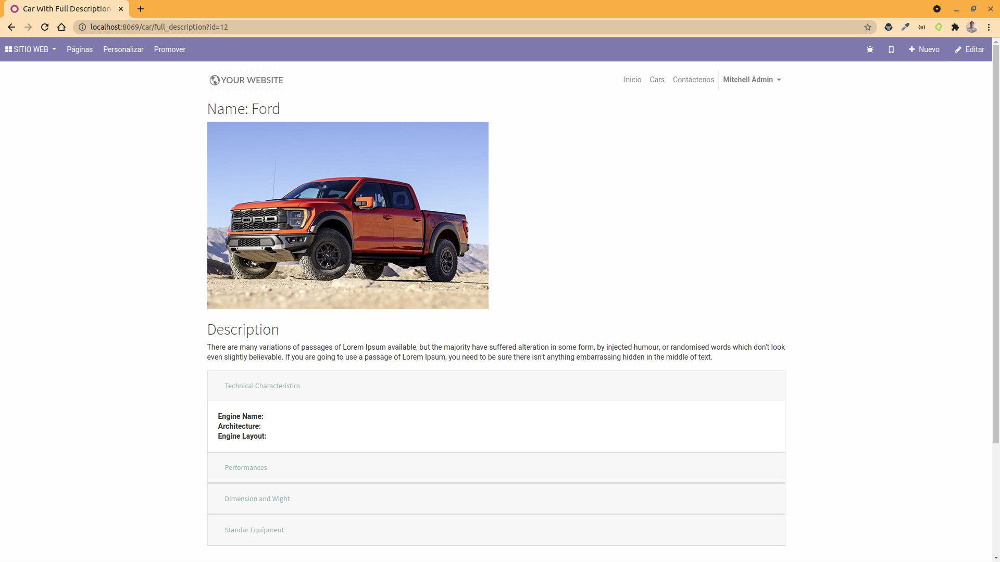

# Resumen

Este repositorio esta basado en el curso de [Odoo 13 Website Development](https://www.udemy.com/course/odoo-13-website-development/) donde el profesor nos permite pintar datos en vistas QWeb de tipo **website.layout** y a su vez creamos varios controladores que permiten leer datos de nuestros modelos para retornarnos en una vista.

De igual manera desarrollamos un CRUD donde empleamos distintos controladores que nos permiten llamar funciones de tipo Create, Read, Update y Delete.

A continuación se muestran algunas imagenes del proyecto finalizado:

